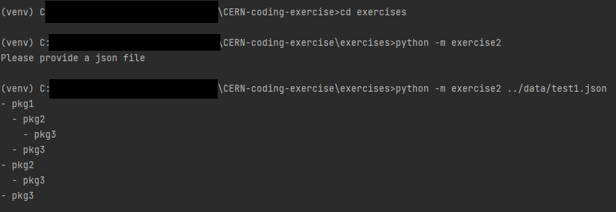

# CERN-coding-exercise

## Exercices

Exercices can be found in the `exercises` folder. Relevant tests can be found in the `tests` folder. Data used for examples can be found in the `data` folder.

## Testing

Tests were conducted using [pytest](https://docs.pytest.org/en/7.4.x/)

```python3
pytest tests
```

## Usage

Module for the second exercise can be used as follows:

```shell
cd exercises
python -m exercise2 filename
```

Example:

